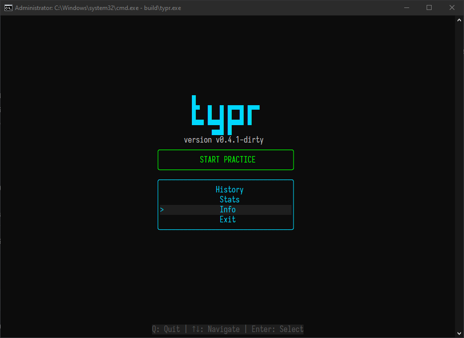
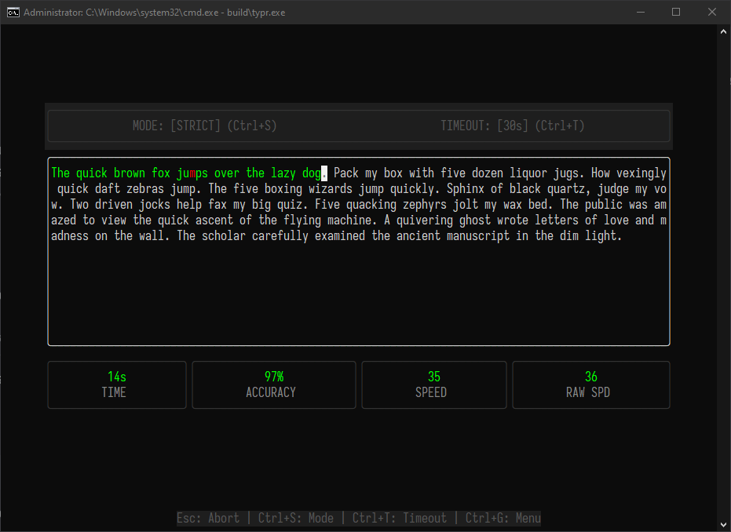
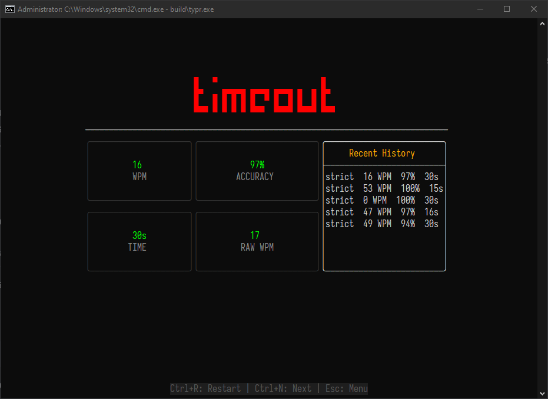
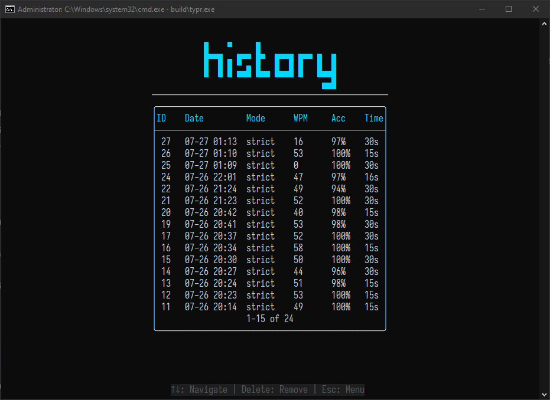
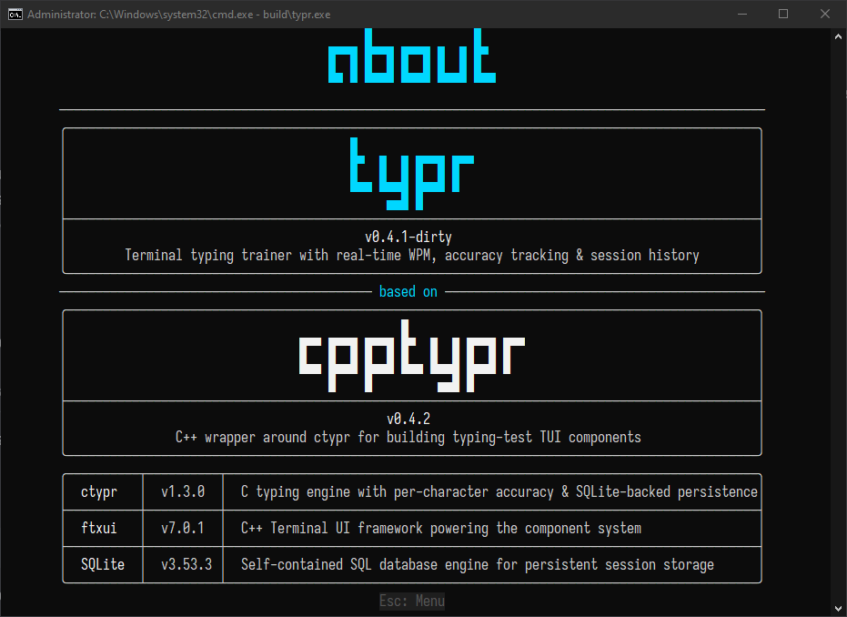

# typr

Typing trainer in your terminal. C++23, FTXUI, real-time feedback.

## Screenshots

| | | |
|:---:|:---:|:---:|
|  |  |  |
| Main menu | Typing session | Session results |

| | |
|:---:|:---:|
|  |  |
| Session history | Version info |

## Why

Most typing trainers run in a browser. typr lives in your terminal. No tabs,
no distractions, no mouse(well, you can still use it if you want).

## Features

- Two modes: strict (fix every mistake) or flow (keep rolling)
- Per-character color feedback as you type
- WPM, accuracy, and timing after every session
- Session history you can scroll, delete, or review
- Best WPM tracked per mode
- SQLite persistence — your data survives a reboot

## Requirements

- CMake >= 3.25
- C++23 compiler: GCC 14+, Clang 18+, MSVC 2022 17.12+
- Internet on first build (CMake fetches FTXUI and cpptypr)

## Build

```sh
git clone https://github.com/AhmedowM/typr.git
cd typr
cmake -B build
cmake --build build
./build/typr
```

## Controls

| Key        | Action              |
|------------|---------------------|
| Tab        | Cycle focus         |
| Enter      | Select              |
| Escape     | Back                |
| ↑ / ↓      | Navigate            |
| Delete     | Remove history row  |
| Ctrl+R     | Restart session     |
| Ctrl+N     | Next text           |
| Ctrl+G / Q | Quit / back to menu |

## Structure

```
src/
  main.cpp
  app/AppController      — screen routing, event loop
  engine/EngineBridge    — UI adapter over cpptypr
  engine/ContentSource   — text provider
  storage/Storage        — SQLite persistence layer
  ui/Theme               — colors, layout helpers
  ui/BigText             — ASCII art text renderer
  ui/Chrome              — shared chrome elements
  ui/screens/
    MainScreen           — logo + navigation
    TypingScreen         — typing area, stats bar
    ResultsScreen        — session summary
    HistoryScreen        — past sessions table
    StatsScreen          — aggregate statistics
    InfoScreen           — versions and credits
  ui/components/
    StatBox              — key-value display
    SettingsBar          — config controls
```

## Dependencies

| Library | Version | What it does |
|---------|---------|--------------|
| FTXUI   | 7.0.1   | Terminal UI framework |
| cpptypr | 0.4.2   | C++ wrapper for ctypr |
| ctypr   | 1.3.0   | C typing engine |
| SQLite  | 3.53.3  | Session database |
